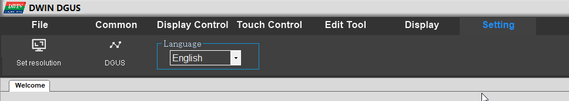

# CR-6 Touchscreen software
Attempt to extend the CR-6 touch screen software. You need the [DGUS v7618 software](http://www.dwin.com.cn/home/Index/download_file?download_id=4847) for that.

After extracting the RAR file, you need to switch to English first:

## Other documentation

Vendor documentation is mirrored to the [doc/vendor](doc/vendor) folder.

In addition, [this is a nice resource](https://github.com/rubienr/MarlinDgusResources/tree/creality-ender-5-plus/projects).
