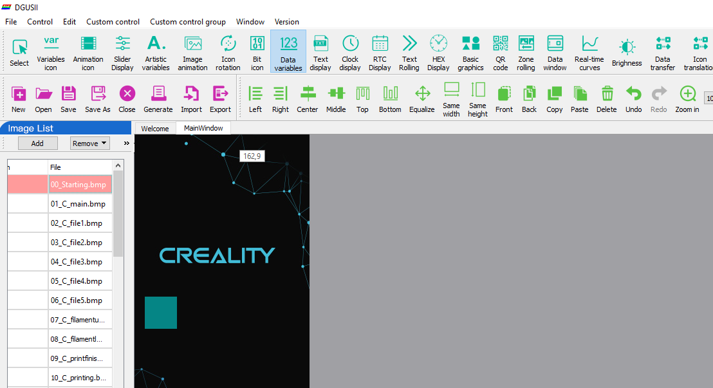
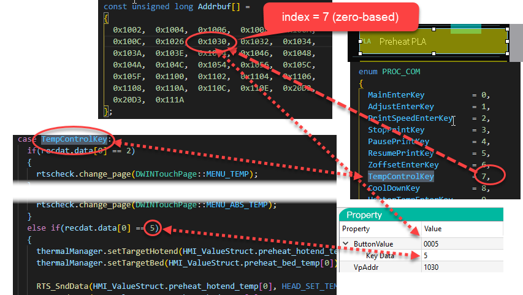
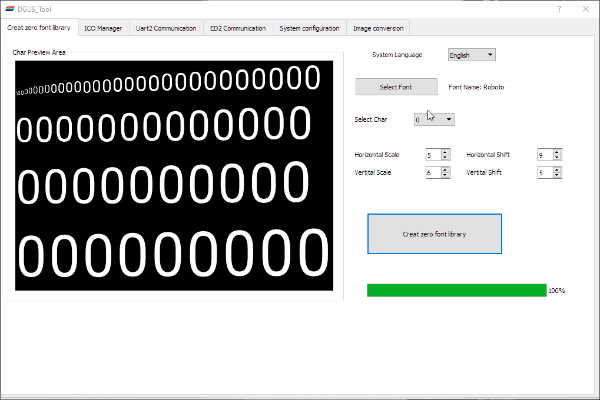

# CR-6 Touchscreen software
Attempt to extend the CR-6 touch screen software. You need the [DGUS v8.0.x software](http://dwin.com.cn/home/Index/download_file?download_id=4796) for that.

You can open the .dgus project file in the [`src\DWIN`](src\DWIN) folder:

## Downloads

Please find official releases in the [Releases section](https://github.com/CR6Community/CR-6-touchscreen/releases). Take the release which belongs to the particular firmware you are going to flash.

Ensure you take the right assets: the `CR-6-touchscreen-[date].zip`. You should not download the `Source code` archive if you are downloading with the purpose of flashing your LCD.

*If you have [a BTT SKR board with the BTT TFT](https://damsteen.nl/blog/2020/11/25/how-to-btt-skr-cr6-installation) you do not need this firmware. This firmware is only for when you use the stock Creality LCD with the stock or BTT motherboard.*

## Contributing

We are open for contributions. **Please open an issue in the issue tracker first before you start work on a pull request.**

The reason for this is that the DWIN project is not friendly for source control and any files cannot be merged (all binary). So, using our Discord server, we synchronize who is working on the files to prevent conflicts.

## Documentation for development
### Build firmware archive

To build a firmware archive for distribution, use the `build.cmd` script.

You need to have Powershell Core installed (pwsh).

### Images / screen images sources

You can find the source files where the screen bitmaps are generated from in the [`src\images_src`](src\images_src) folder.

To update the BMP of a screen put the **generated BMP file you made with your image editor** in the [`src\DWIN\DWIN_SOURCE`](src\DWIN\DWIN_SOURCE) folder. 

#### Updating the touch screen firmware
It will be picked up automatically by the build process of DWIN when saving or generating the project.

Next, re-generate the `32_Screen.icl` ICL file are follows:

As you can note, you update it in both DWIN_SET and ICONS. The first is what goes to the touch screen, the latter is what the IDE uses (apparently).

### How buttons are handled with code

In the currently - cleaned up - source code of the touch screen handling in Marlin, the events of the touch screen are handled as described below. This may change in the future. This picture says it all:

For buttons:

- Virtual Pointers for buttons are defined in `extui/lib/dgus_creality/DGUSDisplayDef.h`
- In `extui/lib/dgus_creality/DGUSDisplayDef.cpp` in the `ListOfVP` the Virtual Pointer are connected to a callback handler
- Because the Creality display used the same VP all over the place, sometimes in completely different functions or values (and this is quite some work to clean up!), these "legacy" VPs are delegated to `DGUSCrealityDisplay_HandleReturnKeyEvent`
- For legacy VPs handlers are defined per page in `extui/lib/dgus_creality/PageHandlers.cpp`
    - The "Key Data" is used to distinguish between the actual key pressed and passed to these functions as `buttonValue`

For dynamic updatable values:

- Dynamic updatable values are Virtual Pointers with a value that is pushed from the display when it is changed, and pushed to the display during the Marlin `idle` loop
- The Virtual Pointers are defined in `extui/lib/dgus_creality/DGUSDisplayDef.h`
- Per dynamically updated virtual pointer there is in `extui/lib/dgus_creality/DGUSDisplayDef.cpp`:
    - A registration in `ListOfVP`, with:
        - The VP ID
        - A pointer to the memory location to read the value from in Marlin (can be `nullptr`)
        - A callback that is triggered when the VP changed in the display and is pushed to firmware
        - A callback that is triggered to format the VP for transfer to the display. This is because strings need to be sent differently than floats, or if your VP does not point to a direct value in memory.
    - A mention in the specific `VPList` for the current page as referenced in `VPMap`. This is to optimize that we don't update VPs that are not displayed anyway.
- Some values like the M117 text are transient and are pushed directly to the display, but are still present in the `ListOfVP`

#### Previous version of the code

If you like to see how the touch screen code is handled in the Creality firmware and the original Community Firmware release 3 and lower, please check the [cf3-legacy](https://github.com/CR6Community/CR-6-touchscreen/tree/cf-3-legacy) branch. This branch is no longer maintained and only exists for historical purposes.

### Touch screen configuration

The touch screen configuration file "T5LCFG_272480.CFG" has its specification describer in [T5L_DGUSII Application Development Guide20200902.pdf](./doc/vendor/T5L_DGUSII%20Application%20Development%20Guide20200902.pdf) chapter 4. You can use an editor like HxD to explore and edit it (with caution!).

### Fonts

Font's are currently configured like below:

In the same folder where you have the DWIN tool unpacked a `0_DWIN_ASC.HZK` file is placed. You need to copy that to the DWIN_SET folder, and can flash it directly.
The kerning of the current font is not ideal (especially using numbers that are small, like "1"), so perhaps we should look for a replacement.

### Other documentation

Vendor documentation is mirrored to the [doc/vendor](doc/vendor) folder.

In addition, [this is a nice resource](https://github.com/rubienr/MarlinDgusResources/tree/creality-ender-5-plus/projects).
