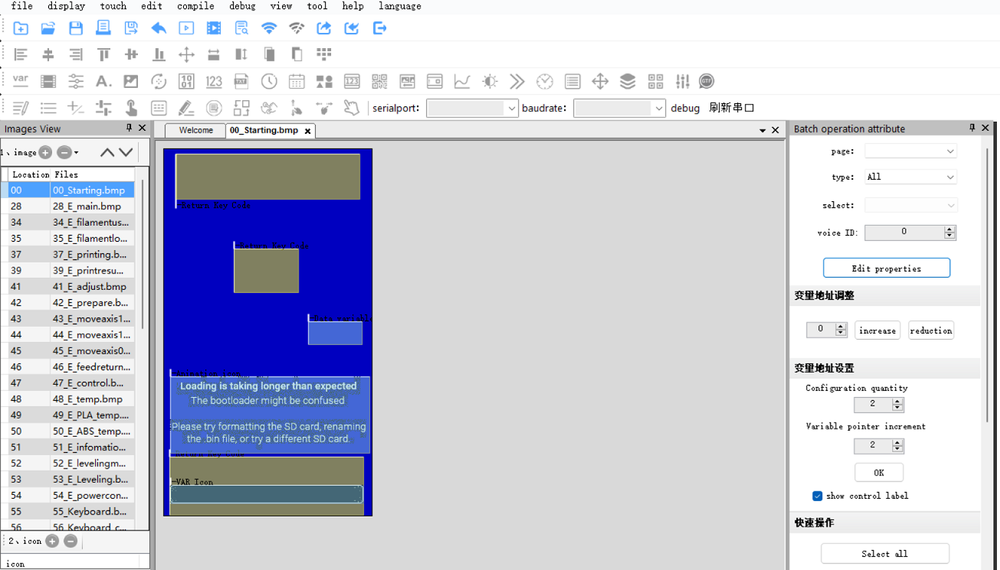

# CR-6 Touchscreen software
Attempt to extend the CR-6 touch screen software. You need the [DGUS v8.0.x software](http://dwin.com.cn/home/Index/download_file?download_id=4796) for that.

You can open the .dgus project file in the [`src\DWIN`](src\DWIN) folder:

## Documentation for development
### Build firmware archive

To build a firmware archive for distribution, use the `build.cmd` script.

You need to have Powershell Core installed (pwsh).

### Images / screen images sources

You can find the source files where the screen bitmaps are generated from in the [`src\images_src`](src\images_src) folder.

To update the BMP of a screen put the **generated BMP file you made with your image editor** in the [`src\DWIN\DWIN_SOURCE`](src\DWIN\DWIN_SOURCE) folder. 

#### Updating the touch screen firmware
It will be picked up automatically by the build process of DWIN when saving or generating the project.

Next, re-generate the `32_Screen.icl` ICL file are follows:

As you can note, you update it in both DWIN_SET and ICONS. The first is what goes to the touch screen, the latter is what the IDE uses (apparently).

### How buttons are handled with code

In the currently - not yet cleaned up - source code of the touch screen handling in Marlin, the events of the touch screen are handled in certain way. This may change when we further refine the code. This picture says it all:

How the code currently works is that there is an `AddrBuf` array that contains the Virtual Pointer addresses (check chapter 7 in [doc/vendor/T5L_DGUSII Application Development Guide20200902.pdf](./doc/vendor/T5L_DGUSII%20Application%20Development%20Guide20200902.pdf)). The enum `PROC_COM` contains the indices in that array. 

Virtual Pointer addresses are shared between buttons, so the "Key Data" is used to distinguish between the actual key pressed.

### Touch screen configuration

The touch screen configuration file "T5LCFG_272480.CFG" has its specification describer in [T5L_DGUSII Application Development Guide20200902.pdf](./doc/vendor/T5L_DGUSII%20Application%20Development%20Guide20200902.pdf) chapter 4. You can use an editor like HxD to explore and edit it (with caution!).

### Fonts

Font's are currently configured like below:

In the same folder where you have the DWIN tool unpacked a `0_DWIN_ASC.HZK` file is placed. You need to copy that to the DWIN_SET folder, and can flash it directly.
The kerning of the current font is not ideal (especially using numbers that are small, like "1"), so perhaps we should look for a replacement.

### Other documentation

Vendor documentation is mirrored to the [doc/vendor](doc/vendor) folder.

In addition, [this is a nice resource](https://github.com/rubienr/MarlinDgusResources/tree/creality-ender-5-plus/projects).
