**CAUTION: THIS FILE IS OUT OF DATE.  IT IS HERE TO PRESERVE KEY USEFUL INFO UNTIL THE REPLACEMENT DOCUMENTATION (CURRENTLY IN WIP) IS READY TO POST.** - Thinkersbluff.

# Introduction
## Purpose
The CR6Community Firmware User Interface (UI) is built and maintained using a set of Community-maintained image files and an integrated UI programming tool suite from DWIN Technologies.

This purpose of this document is to describe the files, the file structure, the tools and the workflows, in sufficient detail (hopefully) to enable future developers and interested 3rd parties to repair, extend and enhance the UI.

## Scope
The scope of this document is limited to explaining  the structure of the Refactored CR6Community Firmware and how one may  modify it, using the supplied [DGUSTool 8.2.1.14](https://github.com/CR6Community/CR-6-touchscreen/releases/download/v2.0.8.1-cr6-community-release-6.1/DGUS_Tool_V8.2.1.14.7z).

_**NOTE**: These instructions are **specific** to the Refactored DWIN_SET.  Previous versions of the UI were generated and maintained using DGUSTool version 8.0.1.1, which operates slightly differently and which generates a DWIN_SET which only operates on DGUS2 v3.5._

## Document Overview
This document is organized into the following sections:**

- **The Structure**
  - **Where the files are** - an overview of the source (src) files from which the DWIN_SET is generated
  - **What the files are** - a brief explanation of the purpose of each type of source file
  - **Integration with the Motherboard Firmware** - how and why the Touchscreen firmware and the Motherboard firmware are integrated

- **The DGUSTool Suite** - the structure of the tool and an overview of its components  

- 
  **Making Modifications**
  - **Building ICL files** - an explanation of how to use the DGUSTool to generate - from the src files - the compressed graphics (ICL) files which are flashed to the display.
  - **Building DWIN_SET** - a brief outline of the workflow by which one generates a new version of the DWIN_SET for the CR6Community Firmware.
  - **Adding New Features** - a discussion of how one might go about extending or modifying this UI, going-forward.
  - "**Rolling your own**" - how you might fork and customize this UI for you own purposes (e.g. to change the language)

- **Other Helpful Resources**

# The Refactored CR6 Community Touchscreen Firmware

## This DGUS Project's File Structure
TBA

## The DGUSTool Suite

You will need [the DGUS v8.2.1.14.x software](https://github.com/CR6Community/CR-6-touchscreen/tree/extui/Tools) for editing the DWIN_SET touchscreen functionality. 

e.g.: 
- Follow the above link
- Right-click and Save Link As..., to download a copy of that tool from the CR6Community Touchscreen Firmware repository.  
- Unzip the toolsuite to a Windows PC 
- Open the folder DGUS_Tool_V8.2.1.14 and double-click DGUS_Tool_V8.2.1.14.exe, to launch the tool

You will see a screen similar to this one, when the tool has launched:

## How to Make Modifications
### Open the Project in the DGUSTool
If you have not already done so, clone the [CR6Community Firmware Touchscreen GitHub repository](https://github.com/CR6Community/CR-6-touchscreen) to your local drive.

Open the DGUSTool 8.2.1.14.

IF you have opened the project before, then you can just select the link under the "History" header, to open it again.

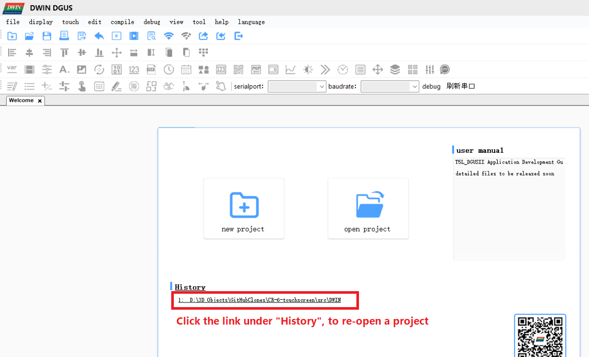

IF this is the first time you are opening the project:

- Select the "Open Project" button
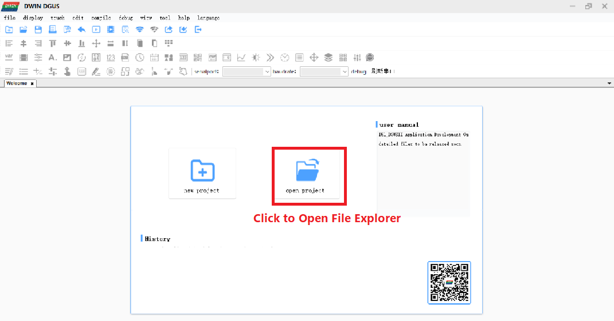

- Navigate to your local copy of the CR6Community Firmware Touchscreen project files (this example assumes that you have cloned the repository to your D: drive, in a folder called "CR-6-touchscreen", as a subfolder inside,  "3D Objects/GitHubClones"):
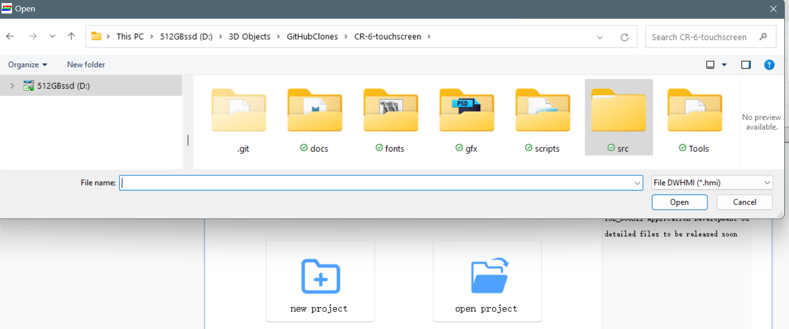

- Navigate to the src/DWIN folder 

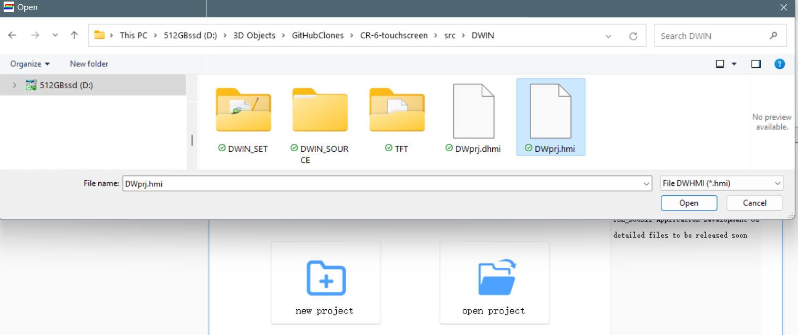
- Open the DWprj.hmi file

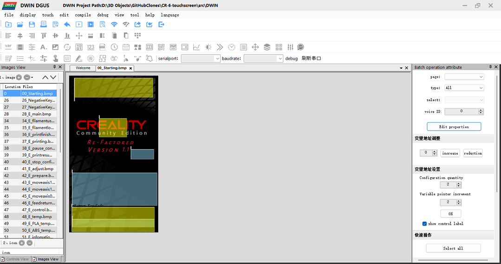

 

If your screen matches the above example, you now have the project open in the DGUSTool.
### Browsing the Existing Application
**NOTE:** A complete discussion of the DGUSTool interface is beyond the scope of this document.  The following information is "just enough" to be able to perform the basic tasks described below. A little experimentation with the various controls can help improve the overall efficiency and effectiveness of your workflows with this tool.
#### Left Side Window
The left side window of the DGUSTool Application allows you to browse through the menu screens and the controls.
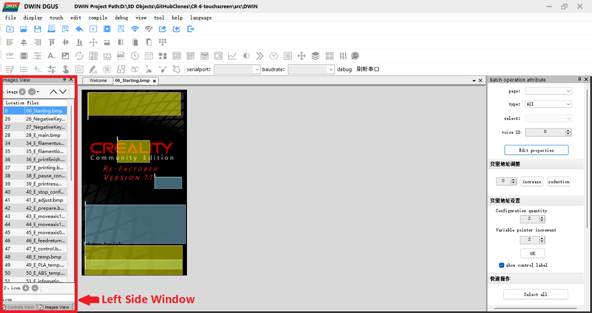

The two buttons at the bottom of the left side window allow you to toggle between the Page browser mode (Images View) and the object browser mode (Controls View):

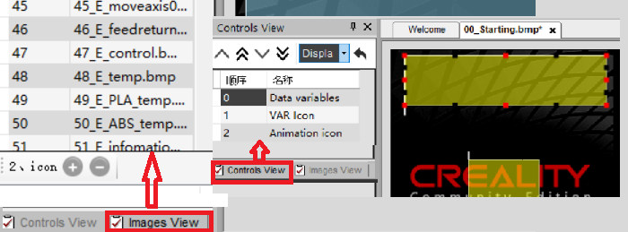

The Controls view offers a further refinement of which object type you wish to browse, on the current page:
- Display objects
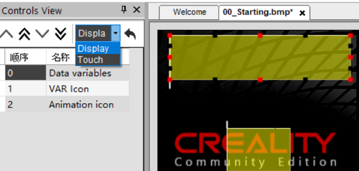
-  or Touch-Control objects
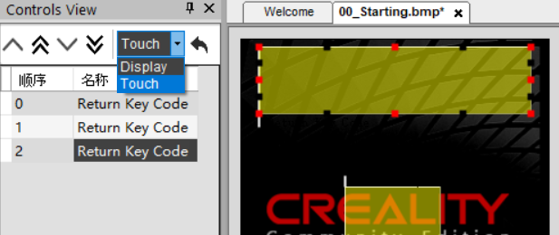

#### Right Side Window
The right side window of the DGUSTool Application allows you to view and modify the properties of the object currently selected in the left side window Controls browser or in the middle window graphics browser.
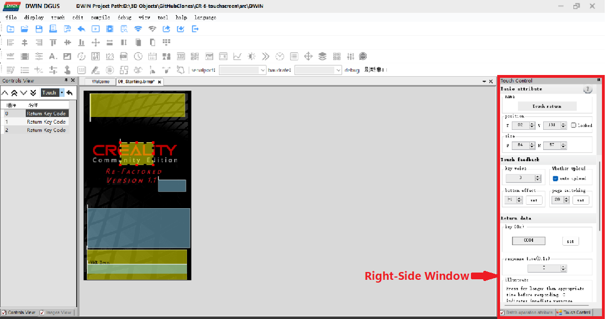 

The specific information and properties available in the right-hand window will vary according to the specific selected object.  An itemization of the specifics is beyond the scope of this document.  

#### Middle Window
The middle window displays the currently selected display page, including the background image and the display and control objects embedded on that page. 

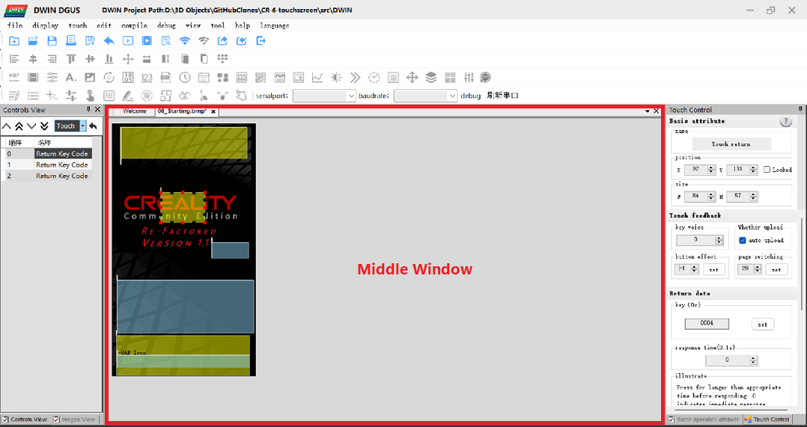

The user can select objects directly, by clicking on their graphic representation in the middle window or by clicking on their name in the Controls Browser in the left side window.

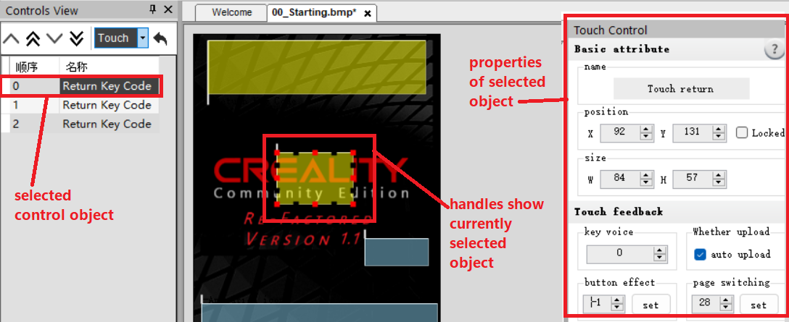 

The currently selected object on the currently displayed page is highlighted in the middle window, with "handles".  The small square "handle" icons highlight the border of the object. The object can be resized by clicking and dragging the applicable handle.

One must select the Images view in the left side window, to select a different page.  Each page selected will appear on its own tab in the middle window. One can readily switch between tabs in the middle window, to switch between the currently selected windows.

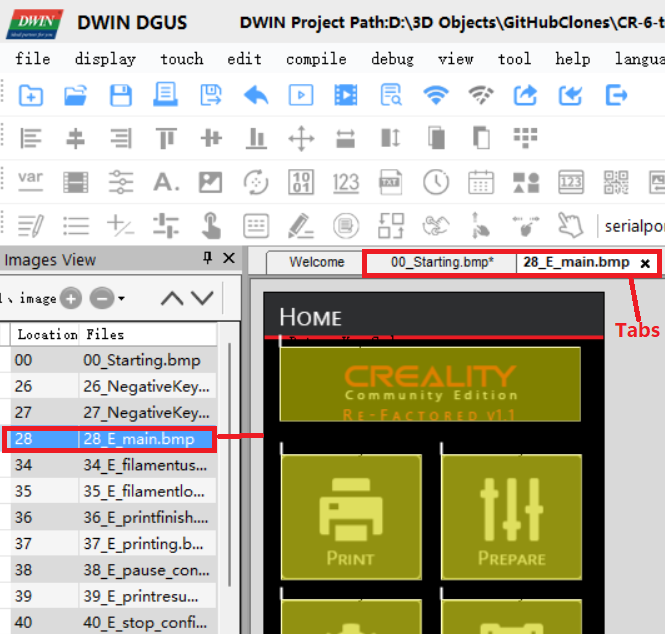 

### Modifying Existing Features
TBA
### Adding New Features
TBA

### Modifying the Pages
TBA
### Modifying the Graphics
TBA
### Modifying the Variables
TBA
### Building ICL Files
TBA
### Building DWIN_SET
TBA
### "Rolling Your Own"
#### Translations / localization 

Internationalization support in DGUS DWIN is very cumbersome. 
- The text on the background bitmaps for each screen, each button, and each icon is embedded in the bitmaps. To translate and have it first-class, you would need to duplicate all the bmps, give each version of each bitmap a separate ID, and keep track of that mapping in firmware, which is a lot of work. The volunteers in the development team have no capacity to maintain localizations that way.

If you want to translate the English-only user interface into your own language, you instead have the option of forking this repository and building maintaining your own version of the touch screen firmware.

The complete workflow could look like this:

1. Fork this repository.
2. Work on the extui branch (this is the branch for all work going forward)
3. In your fork, follow [the steps in the images section of this file](#images--screen-images-sources) to change the current bitmaps and translate them.
4. Use the DWINTools ICL Tool to generate new 23_Screens.ICL, 42_Toggles.ICL and 45_Icons.ICL files.
5. Use the DWINTools Tool to Generate the 13_Show.bin, 14_Touch.bin files
6. Overwrite the ICL and bin files in the English-language DWIN_SET folder with your translated files.
7. Flash your localized DWIN_SET to your system.

Good luck, and if you maintain your own translated firmware, please let us know!

===================================================
_**NOTE: Everything below this line is legacy text from previous documentation. It is all under review and revision as part of the effort of completing the above rewrite.**_

### Images / screen images sources

You can find the source files where the screen bitmaps are generated from in the [`/src/DWIN/DWIN_SOURCEimages_src`](./src/DWIN/DWIN_SOURCEimages_src) folder.

To update the BMP of a screen put the **generated BMP file you made with your image editor** in the [`src\DWIN\DWIN_SOURCE`](src\DWIN\DWIN_SOURCE) folder. 

#### Updating the touch screen firmware files

It will be picked up automatically by the build process of DWIN when saving or generating the project. However, the ICL file is what actually gets flashed. This is essentially a dictionary of concatenated compressed JFIF files.

Next, re-generate the `23_Screen.icl` ICL file are follows:

Things worthy of note:

- Quality is set to 100%, followed by pressing the "Set all" button to apply it to each import file.
- The `DWIN_SOURCE` is used as a source for generating the ICL.
- The ICL is saved twice: once in the `DWIN_SOURCE` folder, once in the `DWIN_SET` folder.

As you can note, you update it in both `DWIN_SET` and `DWIN_SOURCE`. The first is what goes to the touch screen, the latter is what the DWIN editor uses (apparently).

For icon ICL generation the process is the same, except that you pick the icons from a subdirectory of `DWIN_SOURCE`.

### Flash space

DWIN uses a specific set-up of the flash space as described in the manual - as shown below.

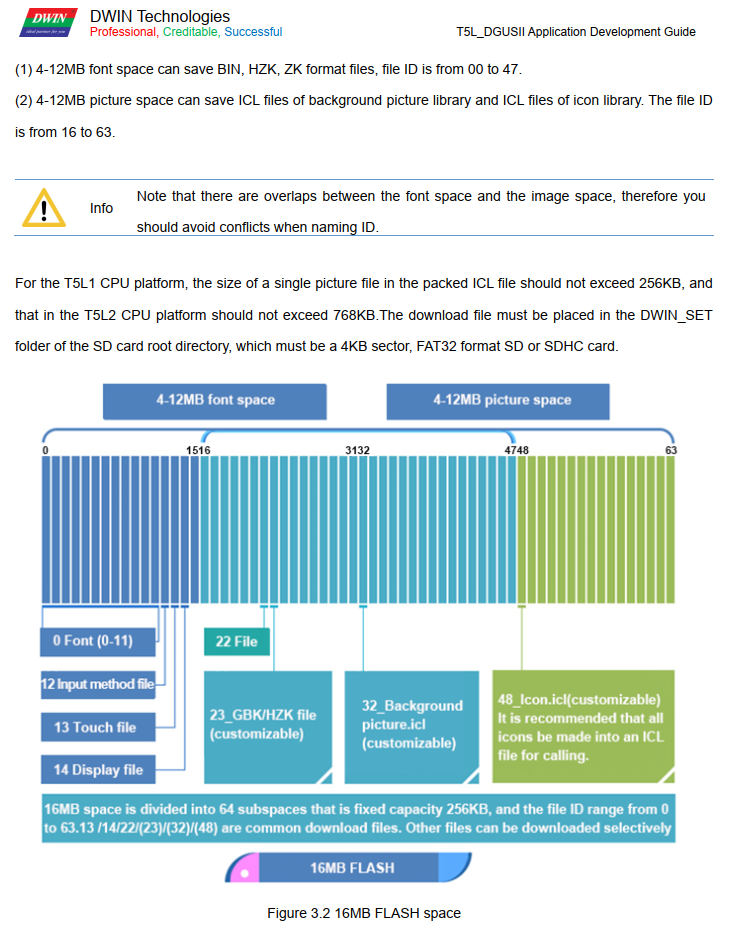

Essentially what it boils down to:

- The flash space is divided into 256KB sectors
- The number prefix on the ICL/HZK/BIN file name is the sector number where the file is flashed
- A sector can only contain a single file
- A file can span over multiple sectors, and if a file needs 1½ sectors for instance, it will allocate 2 sectors.
- There is no protection against sector overwriting: if you have files overlap sectors, DWIN will happily flash the next file over the previous file

So with the above in mind one must take care to make sure files do not overlap. When you flash everything to the touch screen you must ensure you've deleted the old (renumbered) ICL files from your SD card, otherwise weird things will happen. Background may go missing, etc.

During build a script will run to make sure no sectors have been overallocated. You can also run this script manually.

### How buttons are handled with code

In the currently - cleaned up - source code of the touch screen handling in Marlin, the events of the touch screen are handled as described below. This may change in the future. This picture says it all:

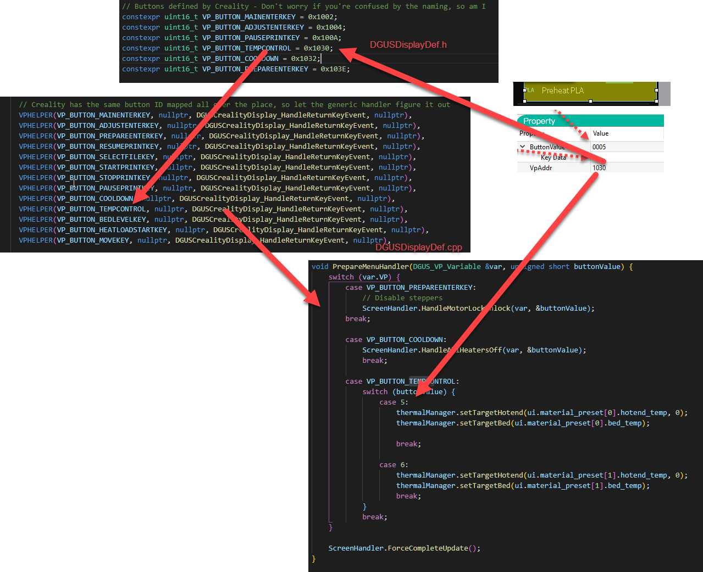

For buttons:

- Virtual Pointers for buttons are defined in `extui/lib/dgus_creality/DGUSDisplayDef.h`
- In `extui/lib/dgus_creality/DGUSDisplayDef.cpp` in the `ListOfVP` the Virtual Pointer are connected to a callback handler
- Because the Creality display used the same VP all over the place, sometimes in completely different functions or values (and this is quite some work to clean up!), these "legacy" VPs are delegated to `DGUSCrealityDisplay_HandleReturnKeyEvent`
- For legacy VPs handlers are defined per page in `extui/lib/dgus_creality/PageHandlers.cpp`
    - The "Key Data" is used to distinguish between the actual key pressed and passed to these functions as `buttonValue`

For dynamic updatable values:

- Dynamic updatable values are Virtual Pointers with a value that is pushed from the display when it is changed, and pushed to the display during the Marlin `idle` loop
- The Virtual Pointers are defined in `extui/lib/dgus_creality/DGUSDisplayDef.h`
- Per dynamically updated virtual pointer there is in `extui/lib/dgus_creality/DGUSDisplayDef.cpp`:
    - A registration in `ListOfVP`, with:
        - The VP ID
        - A pointer to the memory location to read the value from in Marlin (can be `nullptr`)
        - A callback that is triggered when the VP changed in the display and is pushed to firmware
        - A callback that is triggered to format the VP for transfer to the display. This is because strings need to be sent differently than floats, or if your VP does not point to a direct value in memory.
    - A mention in the specific `VPList` for the current page as referenced in `VPMap`. This is to optimize that we don't update VPs that are not displayed anyway.
- Some values like the M117 text are transient and are pushed directly to the display, but are still present in the `ListOfVP`

#### Previous version of the code

If you like to see how the touch screen code is handled in the Creality firmware and the original Community Firmware release 3 and lower, please check the [cf3-legacy](https://github.com/CR6Community/CR-6-touchscreen/tree/cf-3-legacy) branch. This branch is no longer maintained and only exists for historical purposes.

### Touch screen configuration

The touch screen configuration file "T5LCFG_272480.CFG" has its specification described in [T5L_DGUSII Application Development Guide20200902.pdf](vendor%20docs/T5L_DGUSII%20Application%20Development%20Guide20200902.pdf) chapter 4. You can use an editor like HxD to explore and edit it (with caution!). The DWIN editor also has a way to edit this file. Many parameters can also be set at runtime.

### Fonts

Font's are currently configured like below:

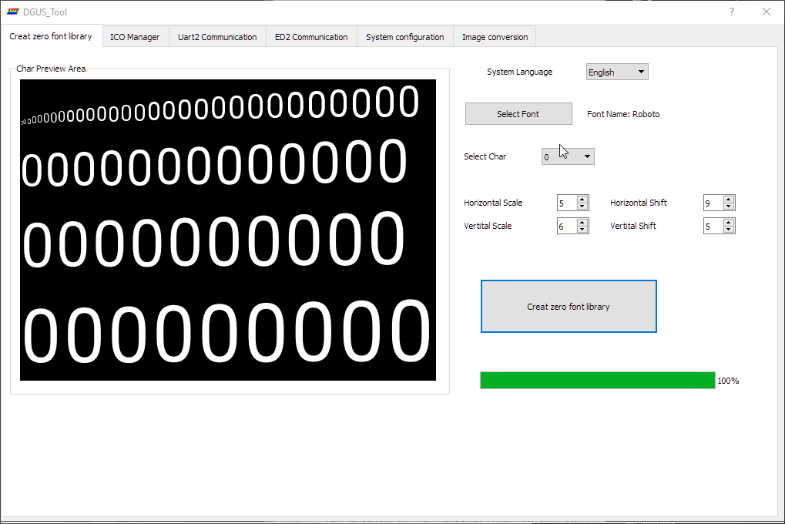

In the same folder where you have the DWIN tool unpacked a `0_DWIN_ASC.HZK` file is placed. You need to copy that to the DWIN_SET folder, and can flash it directly.
The kerning of the current font is not ideal (especially using numbers that are small, like "1"), so perhaps we should look for a replacement.

### Other documentation

Vendor documentation is mirrored to the [vendor docs](vendor%20docs) folder.

In addition, [this is a nice resource](https://github.com/rubienr/MarlinDgusResources/tree/creality-ender-5-plus/projects).

## Credits

[The core CR-6 Community firmware dev team](https://github.com/CR6Community/Marlin#credits)

Icons from [Font Awesome](https://fontawesome.com/) and [Remix Icon](https://remixicon.com/).

Font from [Google Fonts](https://fonts.google.com/specimen/B612) and customized with [FontForge](https://fontforge.org)