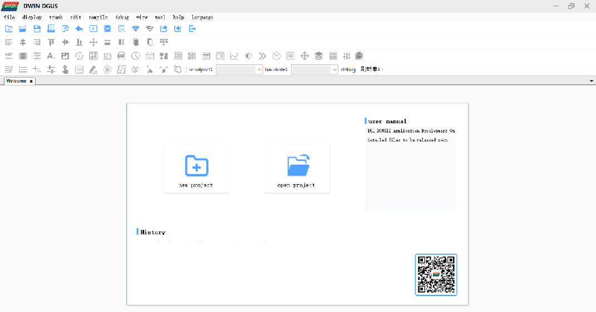

**CAUTION: THIS FILE IS OUT OF DATE.  IT IS HERE TO PRESERVE KEY USEFUL INFO UNTIL THE REPLACEMENT DOCUMENTATION (CURRENTLY IN WIP) IS READY TO POST.** - Thinkersbluff.

# Introduction
## Purpose
The CR6Community Firmware User Interface (UI) is built and maintained using a set of Community-maintained image files and an integrated UI programming tool suite from DWIN Technology Co., Ltd..

This purpose of this document is to describe the files, the file structure, the tools and the workflows, in sufficient detail (hopefully) to enable future developers and interested 3rd parties to repair, extend and enhance the UI.

## Scope
The scope of this document is limited to explaining  the structure of the Refactored CR6Community Firmware and how one may  modify it, using the supplied [DGUSTool 8.2.1.14](https://github.com/CR6Community/CR-6-touchscreen/releases/download/v2.0.8.1-cr6-community-release-6.1/DGUS_Tool_V8.2.1.14.7z).

_**NOTE**: These instructions are **specific** to the Refactored DWIN_SET.  Previous versions of the UI were generated and maintained using DGUSTool version 8.0.1.1, which operates slightly differently and which generates a DWIN_SET which only operates on DGUS2 v3.5._

## Document Overview
This document is organized into collapsed sections, to facilitate a rapid scan of the material. The headings provide a high-level overview of the information and a suggested workflow.  Click on the arrow beside the word "details" to expand or collapse each section.

This is the document's Table of Contents:

- [Introduction](#introduction)
  - [Purpose](#purpose)
  - [Scope](#scope)
  - [Document Overview](#document-overview)
- [The Refactored CR6 Community Touchscreen Firmware](#the-refactored-cr6-community-touchscreen-firmware)
  - [The Project File Structure](#the-project-file-structure)
    - [The DWIN\_SET Folder](#the-dwin_set-folder)
      - [The Bitmap .bmp files](#the-bitmap-bmp-files)
      - [The binary .bin files](#the-binary-bin-files)
      - [The T5L Configuration .CFG file](#the-t5l-configuration-cfg-file)
      - [One ICon Library .ICL file per Subfolder in DWIN\_SOURCE](#one-icon-library-icl-file-per-subfolder-in-dwin_source)
      - [The Base-Font .HZK file](#the-base-font-hzk-file)
      - [Optionally - One DGUS2 OS .bin file](#optionally---one-dgus2-os-bin-file)
  - [The DGUSTool Suite](#the-dgustool-suite)
  - [How to Modify an Existing Project](#how-to-modify-an-existing-project)
    - [Open the Project in the DGUSTool](#open-the-project-in-the-dgustool)
    - [Browse the Existing Application](#browse-the-existing-application)
      - [Left Side Window](#left-side-window)
      - [Right Side Window](#right-side-window)
      - [Middle Window](#middle-window)
    - [Modify Existing Features](#modify-existing-features)
    - [Add New Features](#add-new-features)
    - [Modify the Pages](#modify-the-pages)
    - [Modify the Graphics](#modify-the-graphics)
    - [Modify the Variables](#modify-the-variables)
    - [Build the ICL Files](#build-the-icl-files)
    - [Generate Your New DWIN\_SET](#generate-your-new-dwin_set)
    - [Flash and Validate Your New DWIN\_SET](#flash-and-validate-your-new-dwin_set)
    - ["Rolling Your Own"](#rolling-your-own)
      - [Porting another DWIN\_SET application to the CR6](#porting-another-dwin_set-application-to-the-cr6)
      - [Changing the Language of the User Interface](#changing-the-language-of-the-user-interface)
- [Legacy Material](#legacy-material)
    - [Images / screen images sources](#images--screen-images-sources)
      - [Updating the touch screen firmware files](#updating-the-touch-screen-firmware-files)
    - [Flash space](#flash-space)
    - [How buttons are handled with code](#how-buttons-are-handled-with-code)
      - [Previous version of the code](#previous-version-of-the-code)
    - [Touch screen configuration](#touch-screen-configuration)
    - [Other documentation](#other-documentation)
  - [Credits](#credits)

# The Refactored CR6 Community Touchscreen Firmware
The history of the CR6Community Touchscreen Firmware is documented in this repository on GitHub: https://github.com/CR6Community/CR-6-touchscreen/tree/extui

The Refactored version was derived from version 6.1, which only runs on DGUS2 v3.5. 

The Refactored version runs on all versions of DGUS2.

## The Project File Structure
The CR6Community Touchscreen Firmware repository contains more files than just those required to modify and generate the DWIN_SET folder and files.

This document is focussed exclusively on those files which are either inputs to or outputs from the process of modifying and generating the DWIN_SET folder and its contents.

### The DWIN_SET Folder

The firmware flashed to the CR6 stock touchscreen display must be comprised of a specific set of files, collected into a single folder. That folder must be named "DWIN_SET", and it must be placed into the root directory of a correctly partitioned and formatted SD card. 

When that card is placed into the SD card slot of the stock CR6 TFT display, and power is applied to that display, the bootloader routine factory-programmed into that display will search for the DWIN_SET folder and then systematically process the files therein, each according to its filename and extension.

The contents of the Refactored CR6Community Touchscreen Firmware DWIN_SET folder are as shown in this image:

 

 #### The Bitmap .bmp files

The bitmap files in the DWIN_SET folder are NOT there for flashing to the display.  23_Screens.ICL is actually the file that will be flashed to the display,to upload all of those screen background graphics.  The reason those .bmp files are in that folder is that the DGUSTool itself looks there for those images when it opens the DWprj.hmi file.  Those background graphics are essential for the work of positioning and sizing the control and display widgets, when designing individual screens.

#### The binary .bin files

The DGUSTools create and place into the DWIN_SET folder these four .bin files as part of the DWIN_SET generation process:
1. 13TouchFile.bin
2. 14ShowFile.bin
3. 22_Config.bin
4. DWINOS_page_change.bin

Flashing 13TouchFile.bin programs the display with the hotspot coordinates of the touch controls on each screen.

Flashing 14ShowFile.bin programs the display with the graphics to be displayed on each screen.

Flashing 22_Config.bin programs the display with any initial data values pre-programmed into the the DWprj.hmi project in the DGUSTool suite.

The specific purpose of the DWINOS_page_change.bin is not known to this author.

#### The T5L Configuration .CFG file
**CAUTION: This file can be modified using the DGUSTools, but PLEASE NOTE: you can brick your display if you flash it with a badly formed T5L....CFG file**

The T5L....CFG file is used to modify the configuration and state of the DWIN display. 

- **NOTE:** The CR6 Touchscreen Firmware will NOT work with the Creality stock firmware T5L....CFG file (and vice versa).  That is because one function of the T5L file is to configure the bootloader to look for the bootscreen ICL file at memory location 32 in the Creality stock display, but at memory location 23 in the CR6Community display.

#### One ICon Library .ICL file per Subfolder in DWIN_SOURCE

These files must be generated by the author of the DWIN_SET firmware, using the DGUSTool.  There must be one .icl file for each of the subfolders in the DWIN_SOURCE folder:
  - 23_Screens.icl
  - 32_LoadingBar.icl
  - 42_Toggles.icl
  - 45_Icons.icl
  - 50_Animations.icl
  
  Flashing 23_Screens.icl uploads the screen background graphics to the display.

  Flashing 32_LoadingBar.icl uploads the graphics for the firmware loading bar animation, which is used on the Loading screen and on the Print Progress screen.

  Flashing 42_Toggles.icl uploads the images used to simulate toggle button action on the applicable menus (e.g. The FAN ON & FAN OFF buttons are each made from one of these images. One replaces the other, when the button is activated)

  Flashing 45_Icons.icl uploads graphics similar to 42_Toggles, but simulating momentary action buttons (e.g. The Run PID button is made from one of these images.)

  Flashing 50_Animations.icl uploads the graphics from which the "throbber" animation is generated.

  

#### The Base-Font .HZK file

The font file loaded at memory block zero (0) is the base font used in all of the CR6 touchscreen firmware data display fields. 

The font chosen for this project is a monospaced font obtained from Google Fonts and modified in FontForge to substitute the degrees symbol for a backward apostrophe. Using DGUSTools, the font has been scaled, vertically and horizontally offset, and then packaged as 0_DWIN_ASC_New_At_v1.1.HZK.
  

- **NOTES:**
 1. The display will also work with the Creality stock firmware HZK file, but some data displays may not fit into their allocated space, or may be hard to read.
 2.  The font file is particularly slow to flash. It only needs to be flashed once. 

#### Optionally - One DGUS2 OS .bin file

DGUS2 is the DWIN display operating system on which runs the DWIN_SET application. A DGUS2...bin file can be flashed to change the installed version of DGUS2. 

Although previous versions of the CR6 DWIN_SET require that DGUS2 v3.5 be flashed to the display, that is no longer required with the Refactored DWIN_SET.

Newer CR6 printers are now in fact delivered with DGUS2v4.5 or higher factory-installed and calibrated. Flashing DGUS2v3.5 to such displays would acually effectively disable the touchscreen.

## The DGUSTool Suite

You will need [the DGUS v8.2.1.14.x software](https://github.com/CR6Community/CR-6-touchscreen/tree/extui/Tools) for editing the DWIN_SET touchscreen functionality. 

e.g.: 
- Follow the above link
- Right-click and Save Link As..., to download a copy of that tool from the CR6Community Touchscreen Firmware repository.  
- Unzip the toolsuite to a Windows PC 
- Open the folder DGUS_Tool_V8.2.1.14 and double-click DGUS_Tool_V8.2.1.14.exe, to launch the tool

You will see a screen similar to this one, when the tool has launched:

## How to Modify an Existing Project
_**NOTE:** Describing how to create a new project from "scratch" is beyond the scope of this document. With a little experience, however, one should be able to understand how to at least port another existing DWIN display project to work with the CR6 stock display._

### Open the Project in the DGUSTool

If you have not already done so, clone the [CR6Community Firmware Touchscreen GitHub repository](https://github.com/CR6Community/CR-6-touchscreen) to your local drive.

Open the DGUSTool 8.2.1.14.

IF you have opened the project before, then you can just select the link under the "History" header, to open it again.

IF this is the first time you are opening the project:

- Select the "Open Project" button

- Navigate to your local copy of the CR6Community Firmware Touchscreen project files (this example assumes that you have cloned the repository to your D: drive, in a folder called "CR-6-touchscreen", as a subfolder inside,  "3D Objects/GitHubClones"):

- Navigate to the src/DWIN folder 

- Open the DWprj.hmi file

 

If your screen matches the above example, you now have the project open in the DGUSTool.

### Browse the Existing Application
**NOTE:** A complete discussion of the DGUSTool interface is beyond the scope of this document.  The following information is "just enough" to be able to perform the basic tasks described below. A little experimentation with the various controls can help improve the overall efficiency and effectiveness of your workflows with this tool.

#### Left Side Window
The left side window of the DGUSTool Application allows you to browse through the menu screens and the controls.

The two buttons at the bottom of the left side window allow you to toggle between the Page browser mode (Images View) and the object browser mode (Controls View):

The Controls view offers a further refinement of which object type you wish to browse, on the current page:
- Display objects

-  or Touch-Control objects

#### Right Side Window
The right side window of the DGUSTool Application allows you to view and modify the properties of the object currently selected in the left side window Controls browser or in the middle window graphics browser.
 

The specific information and properties available in the right-hand window will vary according to the specific selected object.  An itemization of the specifics is beyond the scope of this document.  

#### Middle Window
The middle window displays the currently selected display page, including the background image and the display and control objects embedded on that page. 

The user can select objects directly, by clicking on their graphic representation in the middle window or by clicking on their name in the Controls Browser in the left side window.

 

The currently selected object on the currently displayed page is highlighted in the middle window, with "handles".  The small square "handle" icons highlight the border of the object. The object can be resized by clicking and dragging the applicable handle.

One must select the Images view in the left side window, to select a different page.  Each page selected will appear on its own tab in the middle window. One can readily switch between tabs in the middle window, to switch between the currently selected windows.

 

### Modify Existing Features
TBA
### Add New Features
TBA

### Modify the Pages
TBA
### Modify the Graphics
TBA
### Modify the Variables
TBA
### Build the ICL Files
TBA
### Generate Your New DWIN_SET
TBA
### Flash and Validate Your New DWIN_SET
TBA
### "Rolling Your Own"

#### Porting another DWIN_SET application to the CR6
TBA
#### Changing the Language of the User Interface
 

The stock CR6 printer DWIN_SET firmware from Creality is available in either Chinese/English or 9-Language versions.

The CR6Community Touchscreen Firmware only supports English-language displays and controls.

The author of this document does not know how Creality has implemented multiple languages, but the CR6 Touchscreen design relies upon text written directly into the background bitmaps for each screen and directly into the graphical icons used for buttons and toggles.

Changing the basic design of the CR6Community Firmware to support multiple languages is far too laborious for the Community volunteers to undertake.

If you want to translate the English-only user interface into your own language, you are welcome to fork this repository and build/maintain your own version of the CR6Community Touchscreen firmware.

Your workflow might look like this:

1. Fork this repository.
2. Work on the extui branch (this is the branch for all work going forward)
3. In your fork, follow [the steps in the images section of this file](#images--screen-images-sources) to change the current bitmaps and translate them.
4. Use the DWINTools ICL Tool to generate new 23_Screens.ICL, 42_Toggles.ICL and 45_Icons.ICL files.
5. Use the DWINTools Tool to Generate the 13_Show.bin, 14_Touch.bin files
6. Overwrite the ICL and bin files in the English-language DWIN_SET folder with your translated files.
7. Flash your localized DWIN_SET to your system.

Good luck, and if you maintain your own translated firmware, please let us know!
 

===================================================
# Legacy Material
_**NOTE: Everything below this line is legacy text from previous documentation. It is all under review and revision as part of the effort of completing the above rewrite.**_

### Images / screen images sources

You can find the source files where the screen bitmaps are generated from in the [`/src/DWIN/DWIN_SOURCEimages_src`](./src/DWIN/DWIN_SOURCEimages_src) folder.

To update the BMP of a screen put the **generated BMP file you made with your image editor** in the [`src\DWIN\DWIN_SOURCE`](src\DWIN\DWIN_SOURCE) folder. 

#### Updating the touch screen firmware files

It will be picked up automatically by the build process of DWIN when saving or generating the project. However, the ICL file is what actually gets flashed. This is essentially a dictionary of concatenated compressed JFIF files.

Next, re-generate the `23_Screen.icl` ICL file are follows:

Things worthy of note:

- Quality is set to 100%, followed by pressing the "Set all" button to apply it to each import file.
- The `DWIN_SOURCE` is used as a source for generating the ICL.
- The ICL is saved twice: once in the `DWIN_SOURCE` folder, once in the `DWIN_SET` folder.

As you can note, you update it in both `DWIN_SET` and `DWIN_SOURCE`. The first is what goes to the touch screen, the latter is what the DWIN editor uses (apparently).

For icon ICL generation the process is the same, except that you pick the icons from a subdirectory of `DWIN_SOURCE`.

### Flash space

DWIN uses a specific set-up of the flash space as described in the manual - as shown below.

Essentially what it boils down to:

- The flash space is divided into 256KB sectors
- The number prefix on the ICL/HZK/BIN file name is the sector number where the file is flashed
- A sector can only contain a single file
- A file can span over multiple sectors, and if a file needs 1½ sectors for instance, it will allocate 2 sectors.
- There is no protection against sector overwriting: if you have files overlap sectors, DWIN will happily flash the next file over the previous file

So with the above in mind one must take care to make sure files do not overlap. When you flash everything to the touch screen you must ensure you've deleted the old (renumbered) ICL files from your SD card, otherwise weird things will happen. Background may go missing, etc.

During build a script will run to make sure no sectors have been overallocated. You can also run this script manually.

### How buttons are handled with code

In the currently - cleaned up - source code of the touch screen handling in Marlin, the events of the touch screen are handled as described below. This may change in the future. This picture says it all:

For buttons:

- Virtual Pointers for buttons are defined in `extui/lib/dgus_creality/DGUSDisplayDef.h`
- In `extui/lib/dgus_creality/DGUSDisplayDef.cpp` in the `ListOfVP` the Virtual Pointer are connected to a callback handler
- Because the Creality display used the same VP all over the place, sometimes in completely different functions or values (and this is quite some work to clean up!), these "legacy" VPs are delegated to `DGUSCrealityDisplay_HandleReturnKeyEvent`
- For legacy VPs handlers are defined per page in `extui/lib/dgus_creality/PageHandlers.cpp`
    - The "Key Data" is used to distinguish between the actual key pressed and passed to these functions as `buttonValue`

For dynamic updatable values:

- Dynamic updatable values are Virtual Pointers with a value that is pushed from the display when it is changed, and pushed to the display during the Marlin `idle` loop
- The Virtual Pointers are defined in `extui/lib/dgus_creality/DGUSDisplayDef.h`
- Per dynamically updated virtual pointer there is in `extui/lib/dgus_creality/DGUSDisplayDef.cpp`:
    - A registration in `ListOfVP`, with:
        - The VP ID
        - A pointer to the memory location to read the value from in Marlin (can be `nullptr`)
        - A callback that is triggered when the VP changed in the display and is pushed to firmware
        - A callback that is triggered to format the VP for transfer to the display. This is because strings need to be sent differently than floats, or if your VP does not point to a direct value in memory.
    - A mention in the specific `VPList` for the current page as referenced in `VPMap`. This is to optimize that we don't update VPs that are not displayed anyway.
- Some values like the M117 text are transient and are pushed directly to the display, but are still present in the `ListOfVP`

#### Previous version of the code

If you like to see how the touch screen code is handled in the Creality firmware and the original Community Firmware release 3 and lower, please check the [cf3-legacy](https://github.com/CR6Community/CR-6-touchscreen/tree/cf-3-legacy) branch. This branch is no longer maintained and only exists for historical purposes.

### Touch screen configuration

The touch screen configuration file "T5LCFG_272480.CFG" has its specification described in [T5L_DGUSII Application Development Guide20200902.pdf](vendor%20docs/T5L_DGUSII%20Application%20Development%20Guide20200902.pdf) chapter 4. You can use an editor like HxD to explore and edit it (with caution!). The DWIN editor also has a way to edit this file. Many parameters can also be set at runtime.

### Other documentation

Vendor documentation is mirrored to the [vendor docs](vendor%20docs) folder.

In addition, [this is a nice resource](https://github.com/rubienr/MarlinDgusResources/tree/creality-ender-5-plus/projects).

## Credits

[The core CR-6 Community firmware dev team](https://github.com/CR6Community/Marlin#credits)

Icons from [Font Awesome](https://fontawesome.com/) and [Remix Icon](https://remixicon.com/).

Font from [Google Fonts](https://fonts.google.com/specimen/B612) and customized with [FontForge](https://fontforge.org)

