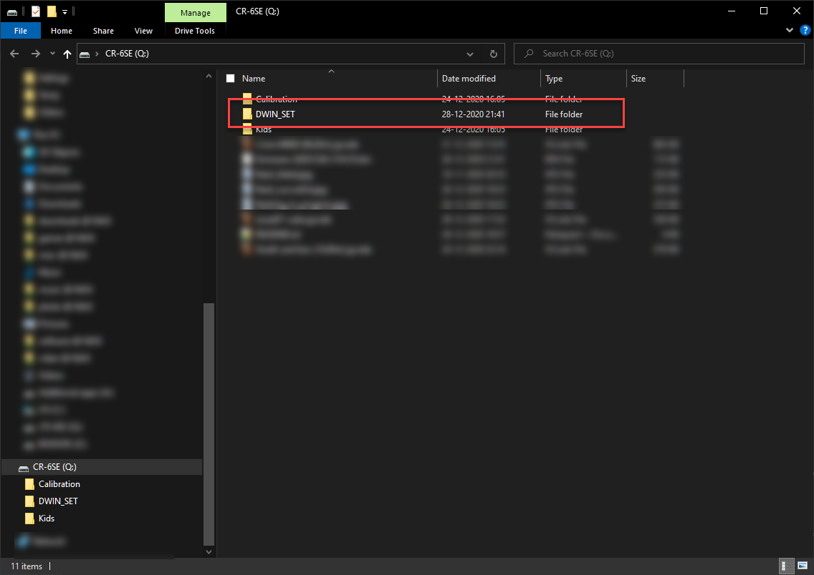
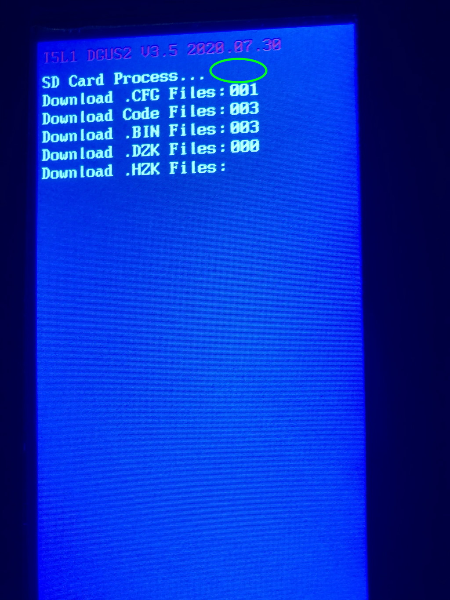
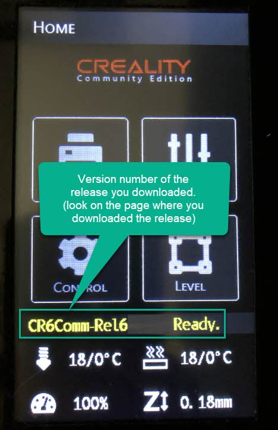
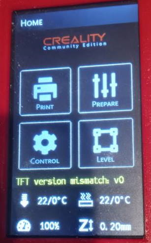

# Instructions for flashing the firmware

As always, this is all on your own risk. The CR-6 Community firmware developers take no responsibility on flashing this firmware.

The touch screen is very picky when it comes to SD cards, partitioning and partition sizes. If you did follow the instructions below and still you could not flash the files properly, try a different SD card and double check you followed the instructions accurately.

This may seem like a chore, and it is, but you're going to need to bite the bullet some time - Creality also issues updates to the touch screen and this has the same issues - although less specific instructions 😉

## Prequisites

1. The CR-6 Community Firmware package downloaded from the 'releases tab'. Don't use the files from the Github source download directly - that won't work. Use the files delivered as assets as part of the release. The ZIP file of the touch screen is included within the release. If this file is called 'README.txt' - you have the correct package.

2. A micro-SD card of 16GB or less - of the type SD or [SDHC](https://en.wikipedia.org/wiki/SD_card#SDHC). It should be formatted FAT32 with 4096 cluster size. Read for instructions on your specific operating system below. Note that cards of type [SDXC](https://en.wikipedia.org/wiki/SD_card#SDXC) do not work. 

## SD card formatting instructions

### Windows Users

Format an micro-SD card as FAT32 with 4096 sector size.
If you like to use the command prompt, you can use this: 

	format /Q X: /FS:FAT32 /A:4096
	
	Where X: is the drive where the SD card is mounted.

If you can't find the option for 4096 sector size your SD card is too large.
You can either use a smaller SD card or can shrink the partition in Disk Manager.

### Linux Users

The SD-card should be formatted FAT32 with 4096 cluster size, with only one partition on the card, starting at sector 8192. The partion should be of type b, "W95 FAT32". Partition table type GPT might not be working, choose type dos.

Commands:
	
	fdisk /dev/sdX where sdX is your SD card's device
	
In fdisk:

	o (new dos partition table)
	n (new partition)
	p (primary)
	1 (partition nr)
	8192 (starting sector)
	enter (last sector) ---> if your SD card is bigger than 8Gb, enter a lower sector number here so that the partition <8Gb
	t (change type)
	b (hex code of W95 FAT32)
	w (write all changes to sd-card)

On the command line:

	mkfs.fat -F 32 -s 8 /dev/sdX1
	fsck.fat -v /dev/sdX1
	mount /dev/sdX1 /mnt

For mainboard firmware:

	cp /path/to/mainboard_firmware.bin /mnt
	
For touchscreen firmware:

	cp -r /path/to/touchscreen-firmware/DWIN_SET /mnt

### Mac Users

First, unmount the SDCard.

    sudo diskutil unmountdisk /dev/diskXXX

Then, format it

    sudo newfs_msdos -F 32 -c 8 -v micro /dev/diskXXX

To figure out what your SDCard path is, you can use the following command:

    sudo diskutil list

It'll list all drives attached to your computer. Look for an entry that matches your SDCard size.
	
## Steps when you have formatted your SD card
	
Take the firmware archive and extract the DWIN_SET folder to the SD card, so that the DWIN_SET folder itself is present on the SD card. Note: Ensure this folder is empty/deleted before you copy the new firmware packages because some files may have been renamed!

Then, follow one of these YouTube videos to complete the flashing process:

https://www.youtube.com/watch?v=Jswzrh2_ekk
https://www.youtube.com/watch?v=2-Mnin3_1jw
https://www.youtube.com/watch?v=9jk3lirEfg0
https://www.youtube.com/watch?v=9jk3lirEfg0

**Be careful that you don't short out the touch screen when flashing it. Ensure the power is not interrupted while flashing.**

### What does a successful flash look like

The flash process is completed when you see "END!" like shown in flash_succesful.jpg. Note that there are several lines showing updated files.

_When flashing has been succesful, repeat the procedure and additional two to three times. The DWIN touch screen doesn't always take "all" files during flashing, so repeating it a few times (by turning the printer off and then on again) should help with that._

After flashing the touch screen has succeeded, you can turn the printer off, and remove the SD card.

If the motherboard is also flashed correctly, after restarting the printer the version will be shown (like in flash_succesful2.jpg). Make sure the version matches with the release of the firmware you downloaded.

### What does an unsuccessful flash look like

- If you get an orange screen, flashing did **not** succeed.

- If you get a blue screen with END!, but the numbers of the updated files only showing "0", flashing did **not** succeed either. Check the examples further down in this document for more information.

- If, after rebooting the printer, a message is shown about "TFT version mismatch" (like in flash_failed2.jpg) then flashing is not successful.

- if, after rebooting the printer, a message is shown about "Firmware flashed incorrectly" then your screen firmware might be flashed but your motherboard ignored the firmware update. This sometimes happens on Creality v4.5.2 boards - reformat your SD card and rename the ".bin" file to something like "today.bin" and retry.

**NOTE** 
We have observed with one user that even though the file counts were correct, the firmware still was not flashed correctly.

If you have issues with the firmware flashing but still elements missing on the touch screen, please try a different SD card, a smaller SD card and partition etc. The touch screen is very picky when it comes to flashing, and there is not much we can change about that 😥

## Examples

**dwin-folder-on-sd-card.png** shows how you place the files on your SD card

**flashing_in_progress.jpg** shows the indicators that flashing is in progress

**flash_succesful.jpg** shows the indicators that flashing has been successful

**flash_succesful2.jpg** shows that after flashing the version number of the firmware is shown. If you (for instance) downloaded Community Firmware Release 7 then "CR6Comm-Rel7 Ready" would show.

**flash_failed.jpg** shows the indicators that flashing has been unsuccesful

**flash_failed2.jpg** shows that the firmware does not recognize the version of the TFT. The LED near the hotend will also keep flashing on and off.

## Troubleshooting

Follow the instruction in "What does an unsuccessful flash look like". 

### My touch screen is garbled, pages are shown partially or the screen stops responding

If the screen stops responding or is not displaying properly, try reflashing the firmware using a __different__ SD card.

Check this issue for more information: https://github.com/CR6Community/Marlin/issues/188