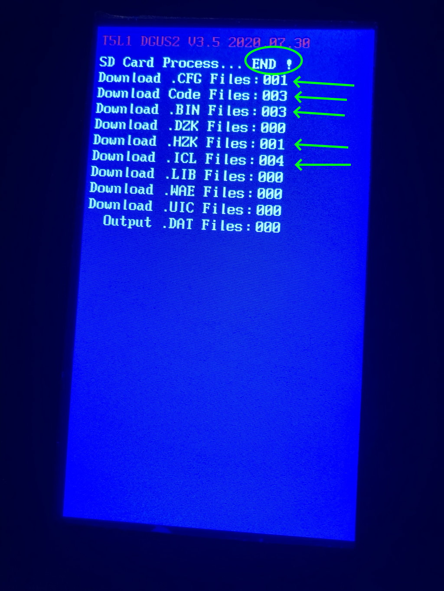
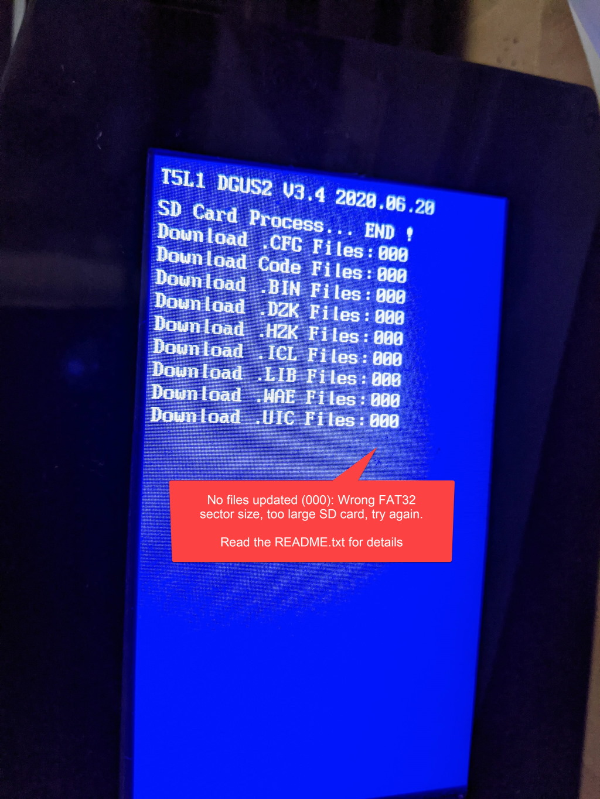

# Instructions for flashing the firmware

As always, this is all on your own risk. The CR-6 Community firmware developers take no responsibility on flashing this firmware.

The touch screen is very picky when it comes to SD cards, partitioning and partition sizes. If you did follow the instructions below and still you could not flash the files properly, try a different SD card and double check you followed the instructions accurately.

This may seem like a chore, and it is, but you're going to need to bite the bullet some time - Creality also issues updates to the touch screen and this has the same issues - although less specific instructions 😉

## Prequisites

1. The community firmware package downloaded from the 'releases tab'. Don't use the files from the Github source download directly - that won't work. Use the files delivered as assets as part of the release. If this file is called 'README.txt' - you have the correct package.

2. A micro-SD card of 16GB or less - of the type SD or [SDHC](https://en.wikipedia.org/wiki/SD_card#SDHC). It should be formatted FAT32 with 4096 cluster size. Read for instructions on your specific operating system below. Note that cards of type [SDXC](https://en.wikipedia.org/wiki/SD_card#SDXC) do not work.

## Windows Users

Format an micro-SD card as FAT32 with 4096 sector size.
If you like to use the command prompt, you can use this: 

	format /Q X: /FS:FAT32 /A:4096
	
	Where X: is the drive where the SD card is mounted.

If you can't find the option for 4096 sector size your SD card is too large.
You can either use a smaller SD card or can shrink the partition in Disk Manager.

## Linux Users

You'Il know what to do. 

## Mac Users

First, unmount the SDCard.

    sudo diskutil unmountdisk /dev/diskXXX

Then, format it

    sudo newfs_msdos -F 32 -c 8 -v micro /dev/diskXXX

To figure out what your SDCard path is, you can use the following command:

    sudo diskutil list

It'll list all drives attached to your computer. Look for an entry that matches your SDCard size.
	
## Once you have your SDCard properly formatted
	
Take the firmware archive and extract the DWIN_SET folder to the SD card, so
that the DWIN_SET folder itself is present on the SD card.

Then, follow this YouTube video to complete the flashing process:
https://www.youtube.com/watch?v=Jswzrh2_ekk

The flash process is completed when you see "END!" like shown in flash_succesful.jpg.
Note that there are several lines showing updated files

If you get an orange screen, flashing did most likely _not_ succeed.
If you get a blue screen with END!, but the numbers of the updated files showing "0", flashing did not succeed either.

After flashing the touch screen, you can turn the printer off, and remove the SD card.

**NOTE** 
We have observed with one user that even though the file counts were correct, the firmware still was not flashed correctly.

If you have issues with the firmware flashing but still elements missing on the touch screen, please try a different SD card, a smaller SD card and partition etc. The touch screen is very picky when it comes to flashing, and there is not much we can change about that 😥

## Examples

**flash_succesful.jpg** shows the indicators that flashing has been successful

**flash_failed.jpg** shows the indicators that flashing has been unsuccesful

